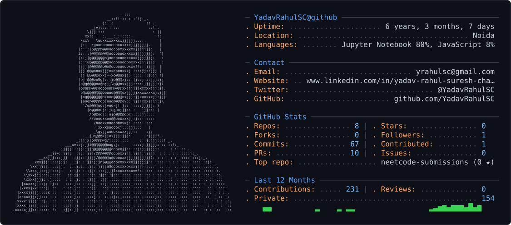

<picture>
  <source media="(prefers-color-scheme: dark)" srcset="Dark_2.svg" />
  <source media="(prefers-color-scheme: light)" srcset="Light_2.svg" />
  
</picture>

 

<!-- NAME / TAGLINE - animated typing -->

 

<!-- SOCIALS — LinkedIn stays brand blue (glyph vanishes on custom fills). Others themed. -->
&nbsp;&nbsp;
&nbsp;&nbsp;
 

---

## This is me :)

I'm **Yadav Rahul Suresh Chandra** fresher in Java Backend Development who approaches engineering with a researcher's discipline before writing my first production API, 
I co-authored a published ML paper predicting cancer aggressiveness from MRI scans. That habit of testing assumptions rigorously now shows up in how I build backend
systems.  🔭 Currently building a full-stack e-commerce app (Spring Boot + React), Dockerized and shipped through a CI/CD pipeline I set up myself with GitHub
Actions 🌱 Deepening my grip on Docker, Docker Compose, and CI/CD — not just using tools, but understanding why they're built the way they are 🎓 M.Tech in Co
mputer Science | Published researcher in applied ML (radiomics, medical imaging) 💬 Ask me about Java, Spring Boot, REST API design, or how machine learning is u
sed in cancer diagnostics 

## my perfect stack`

  

