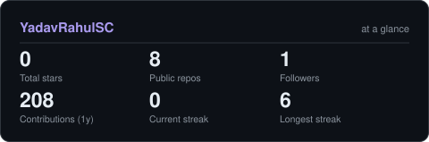

<picture>
  <source media="(prefers-color-scheme: dark)" srcset="dark_mode.svg" />
  <source media="(prefers-color-scheme: light)" srcset="light_mode.svg" />
  
</picture>

 

<!-- NAME / TAGLINE - animated typing -->

 

<!-- SOCIALS — LinkedIn stays brand blue (glyph vanishes on custom fills). Others themed. -->
&nbsp;&nbsp;
&nbsp;&nbsp;
 

---

## This is me :)

I'm **Yadav Rahul Suresh Chandra** fresher in Java Backend Development who approaches engineering with a researcher's discipline before writing my first production API, 
I co-authored a published ML paper predicting cancer aggressiveness from MRI scans. That habit of testing assumptions rigorously now shows up in how I build backend
systems.  🔭 Currently building a full-stack e-commerce app (Spring Boot + React), Dockerized and shipped through a CI/CD pipeline I set up myself with GitHub
Actions 🌱 Deepening my grip on Docker, Docker Compose, and CI/CD — not just using tools, but understanding why they're built the way they are 🎓 M.Tech in Co
mputer Science | Published researcher in applied ML (radiomics, medical imaging) 💬 Ask me about Java, Spring Boot, REST API design, or how machine learning is u
sed in cancer diagnostics 

## my perfect stack`

---

<!-- 
 -->

## signals 

<!-- <table>
<tr>
<td width="50%" align="center" valign="middle"> -->

<!-- Self-rated radar - edit assets/skills.json, the workflow redraws it -->
<!-- <picture>
  <source media="(prefers-color-scheme: dark)"  srcset="assets/radar-dark.svg">
  <source media="(prefers-color-scheme: light)" srcset="assets/radar-light.svg">
  
</picture>

</td>
<td width="50%" align="center" valign="middle"> -->

<!-- Hand-authored contract & language stack radar - edit assets/langmix.json -->
<!-- <picture>
  <source media="(prefers-color-scheme: dark)"  srcset="assets/radar-langs-dark.svg">
  <source media="(prefers-color-scheme: light)" srcset="assets/radar-langs-light.svg">
  
</picture>

</td>
</tr>
</table>

 -->

---
<!-- 

## Numbers matter? ohhh yes. 

<!-- Generated by scripts/cards.py into this repo. Deliberately NOT
     github-readme-stats / streak-stats / github-profile-trophy: those are
     shared public instances that go down and take the whole section with them. -->
<picture>
  <!-- <source media="(prefers-color-scheme: dark)"  srcset="assets/card-stats-dark.svg">
  <source media="(prefers-color-scheme: light)" srcset="assets/card-stats-light.svg">
  
</picture>

 

<!--  -->

<!-- 

<table width="100%" border="0">
  <tr>
    <td width="70%" valign="middle">
      <h1>Hey there, I'm Yadav Rahul Suresh Chandra 👋</h1>
      
    </td>
    <td width="30%" align="right" valign="middle">
      
    </td>
  </tr>
</table>

  
  
  

  
  
  

 

<table align="center" width="100%">
<tr>
<td width="65%" valign="top"> --> -->

## 👨‍💻 About Me

<!-- I'm **Yadav Rahul Suresh Chandra** fresher in Java Backend Development who approaches engineering with a researcher's discipline before writing my first production API, 
I co-authored a published ML paper predicting cancer aggressiveness from MRI scans. That habit of testing assumptions rigorously now shows up in how I build backend
systems.  🔭 Currently building a full-stack e-commerce app (Spring Boot + React), Dockerized and shipped through a CI/CD pipeline I set up myself with GitHub
Actions 🌱 Deepening my grip on Docker, Docker Compose, and CI/CD — not just using tools, but understanding why they're built the way they are 🎓 M.Tech in Co
mputer Science | Published researcher in applied ML (radiomics, medical imaging) 💬 Ask me about Java, Spring Boot, REST API design, or how machine learning is u
sed in cancer diagnostics 

</td>
<td width="35%" align="center" valign="middle">

</td>
</tr>
</table>

  

 -->

## 🐍 Contribution Snake

<!-- <picture>
  <source media="(prefers-color-scheme: dark)" srcset="https://raw.githubusercontent.com/YadavRahulSC/YadavRahulSC/output/github-snake-dark.svg">
  <source media="(prefers-color-scheme: light)" srcset="https://raw.githubusercontent.com/YadavRahulSC/YadavRahulSC/output/github-snake.svg">
  
</picture>

   -->
